# Holiday Generator

## Contents
* [Introduction](#introduction)
    * [Acknowledgements](#acknowledgements)
    * [Objective](#objective)  
    * [My Project](#my-project)  
    * [My Approach](#my-approach)  
* [Project Planning](#project-planning)  
    * [Risk Assessment](#risk-assessment)  
    * [Trello Board](#trello-board)  
* [Architecture](#architecture)   
    * [CI Pipeline](#ci-pipeline)
    * [Jenkins Script](#jenkins-script)
* [Development](#development)
    * [Feature Branching](#feature-branching)
    * [Unit Testing](#unit-testing)  
    * [Front-End Design](#front-end-design) 
* [Future Improvements](#future-improvements)
* [Video Recording](#video-recording)
* [Licencing](#licencing)
* [Authors](#authors)

## Introduction

### Acknowledgements  
I would like to thank Ryan Wright at QA for teaching the contents required to complete this project successfully as well as supervising the project throughout the development of it.

### Objective 

The objectives that were given are: 

You are required to create a service-orientated architecture for your application, this application must be composed of at least 4 services that work together.

### Service #1:    
The core service – this will render the Jinja2 templates you need to interact with your application, it will also be responsible for communicating with the other 3 services, and finally for persisting some data in an SQL database.  

This objective has been mostly met. However I have not used any SQL databases

### Service #2 + #3:    
These will both generate a random “Object”, this object can be whatever you like as we encourage creativity in this project.  

In my case, my service 2 generates a random country and my service 3 generates a random activity that the user can do in that country

### Service #4  
This service will also create an “Object” however this “Object” must be based upon the results of service #2 + #3 using some pre-defined rules.
Please see below for an example of how this logic can look.

The complexity of your logic here is up to you, again a simple implementation is allowed, however, may not showcase your full understanding of the technology.  

My service 4 combines what is generated and manipulates the data to provide an output to my service 1 that can then display this.

The main constraints are that have been given are:  
* Kanban Board: Asana or an equivalent Kanban Board
* Version Control: Git
* CI Server: Jenkins
* Configuration Management: Ansible
* Cloud server: GCP virtual machines
* Containerisation: Docker
* Orchestration Tool: Docker Swarm
* Reverse Proxy: NGINX 

### My Project
My project is a holiday generator. The application generates a random country and a random activity and manipulates these to output a suitable holiday.

### My Approach
The approach I have taken to be able to create this application successfully and effectively is the following:  
* To create a working app that successfully carries out the functions of each service
* Containerise the app using Docker 
* Configure automate the deployment of my app on multiple nodes using Ansible
* Make use of a reverse proxy (Nginx) to make my application accessible to the user
* Implement automated testing and docker-compose deployment using Jenkins 

## Project Planning  

### Risk Assessment
I have created a detailed risk assessment for my project which can be seen below. This displays each risk that is associated with my project showing the impact level, mitigating and contingent actions.  

A link to the risk assessment is also provided here: https://docs.google.com/spreadsheets/d/1c7kJiDlVX2AVnkvvDFuM9cOhnvSuljjiurIerkE7bvs/edit?usp=sharing


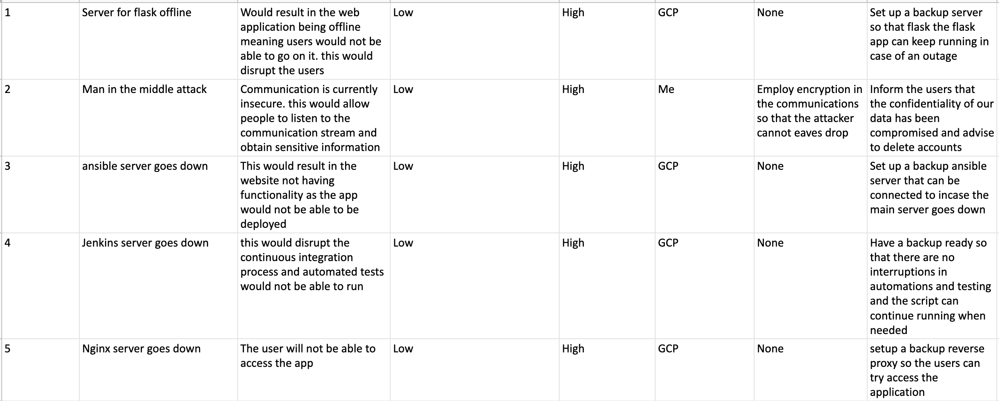

### Trello Board
The website used to track the progress of my project is trello. This was used to create user stories and create cards for each for each process. This allowed maximum efficiency and flow through development in my project.  
  
The link to my trello board is: 


I also have included the link to my trello board:  https://trello.com/b/XQbB5Vz6/project2-board

My board contains:
* User stories so that each user requirement can be worked towards and met successfully.
* Task cards which outline the tasks needed to be completed to achieve the user story requirements
* Testing tasks required for the software.

## Architecture

### CI Pipeline

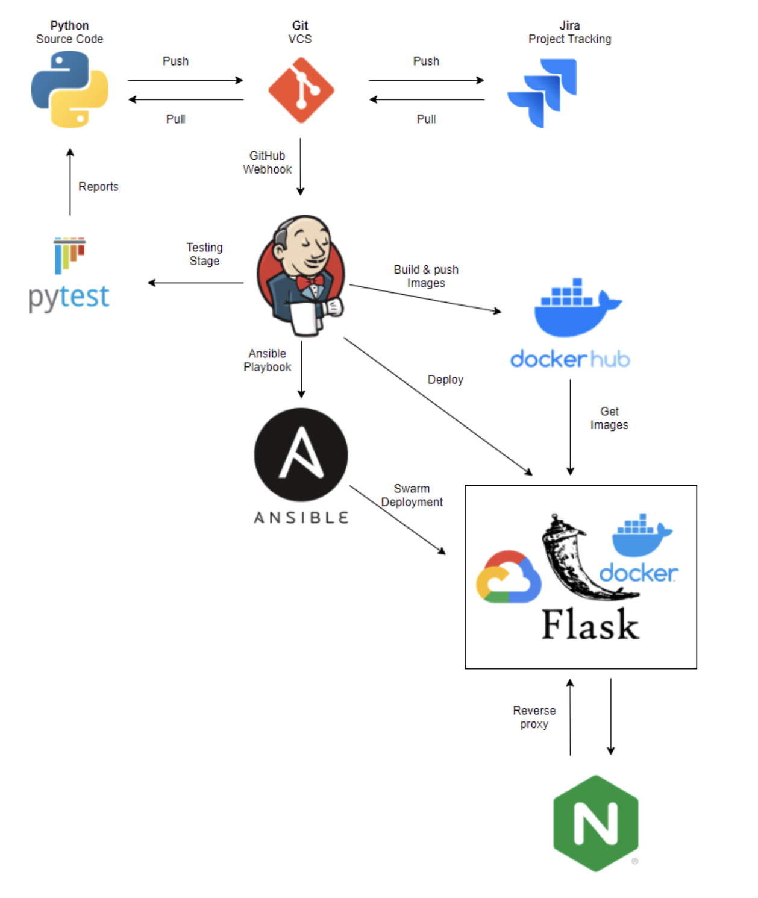

The continuous integration pipeline I have used has been shown above. This contains the the frameworks used for my project. The steps have been orchestrated in order to take my source code from development to deployment. The automation process has all been included and integrated in the pipeline as well  

The way this is carried out is, once any code is pushed to Github, this code will automatically be pushed to Jenkins via a webhook. Jenkins can then run unit and integration tests as well as develop a report so that developer can assess the results from the automated tests run.  

### Jenkins Script  

My Jenkins build:  

Before building the script I had to run the following commands in my VM terminal:

* Update the package manager using "sudo apt update" 
* Install the virutal environment using "sudo apt-get install python3-venv" 
* Install pip3 using "sudo apt install python3-pip"  

The build steps of my Jenkins script are below:

**1.** Clone Repo

```  
steps{
    script{
        if(fileExists('/home/jenkins/.jenkins/workspace/docker-project2/')){
            dir('docker-project2'){ sh 'git pull https://github.com/M-Talha-Saeed/docker-project2.git main'}
        }
        else{
             sh 'git clone https://github.com/M-Talha-Saeed/docker-project2.git'
        }
    }
}
```  

**2.** Install the correct packages for unit-testing and Docker

```  
steps{
    sh 'pip3 install -r requirements.txt'
} 
```

**3.** Carry out testing on each service and display the coverage of each test

```
steps{
    sh 'cd api1 && python3 -m pytest --cov=application'
    sh 'cd api2 && python3 -m pytest --cov=application'
    sh 'cd api3 && python3 -m pytest --cov=application'
    sh 'cd api4 && python3 -m pytest --cov=application'
}
```  

**4.** Build the containers and application
```
steps{
    sh 'sudo docker-compose build'
    sh 'sudo docker-compose push'
}
```  
**5.** Deploy the application
```
steps{
    sh 'sudo docker-compose up -d'
}
```  
This script successfully tests, builds and deploys. The following is the result of running jenkins: 

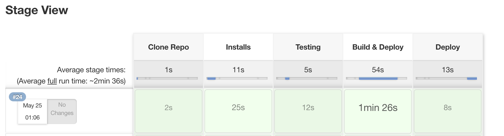

## Development
The development stage of my project contains unit testing, Ansible, Nginx, Docker-Compose and the front-end design and development.

### Feature Branching  
Throughout the development of my project, I used feature branching on github when pushing my work. This allowed each feature to be worked on and be pushed without interfering with other features. 

My network can be seen below:

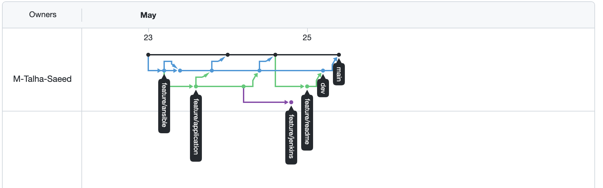

### Unit Testing  

I have used pytest to run the tests for each service and its functions.

Below are my console output of the tests and their coverage when running the unit testing for each service

Service 1 Test:

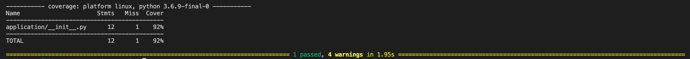   

Service 2 Test:  

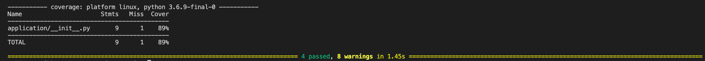   

Service 3 Test:  

  

Service 4 Test:

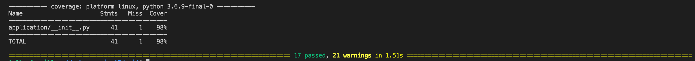

These tests are also automated and ran on a jenkins pipeline:  

Jenkins test Service 1:  
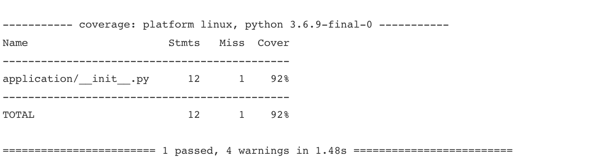  

Jenkins test Service 2:  

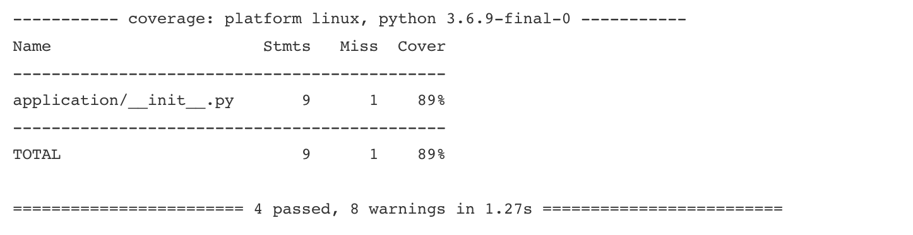  

Jenkins test Service 3:  

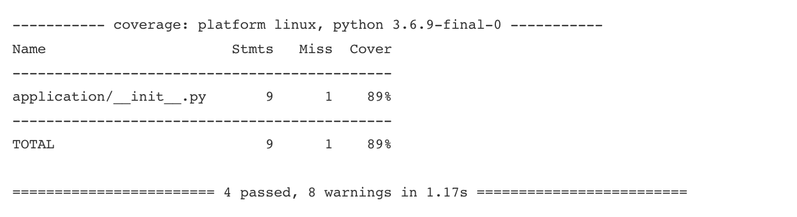  

Jenkins test Service 4: 

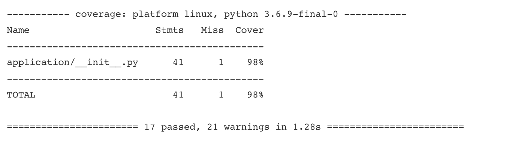  


### Front-End Design

My aim for the front-end design was simplicity and to focus on the output of the service 1 to be correct rather than aesthetics. I chose to focus on the automation and deployment processes on this project rather than making the app highly functional. This is because I wanted to try and perfect my understanding of the devops procedures of automating in this project as I already felt confident in my ability to make a flask app from the precious project.

Once the user navigates to the URL, service 1 is shown, which displays the manipulations of services 2 & 3 that occur in service 4.

The first word displayed is the randomly generated country.  
The second word displayed is the randomly generated activity.  
The third line displays the full holiday and activity that has been generated for the user.  

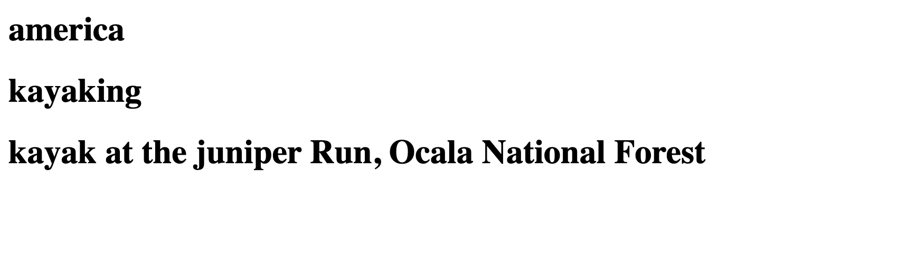  

### Troubleshooting  

One issue that occured in my project, is that when deploying my app, I kept encountering an error that would say my services already exist although they did not. To rectify this, I edited my docker-compose file which at first, was deploying replicas. Once I removed the deployment of more than one replica, my project successfully deployed.

## Future Improvements  
Overall, I would class this project as a success. However this never rules out the opportunity for improvement. Below, is the list of improvements that I would like to implement to future projects:

* I would like to improve my time management as many errors were encountered over the course of the project which resulted in a longer time to complete. This is something I need to rectify as if I had managed the time on this project and started earlier, I would be able to focus on adding complexity to the app due to having spare time.

* Another improvement I would like to implement in the future is to use create a better front-end design. My front-end design is very basic and isnt user interactive. This is something I didnt focus on and needs to be improved in the future to improve my application.

* A requirement of service one was to implement the use of SQL databases. This is something I did not implement and can be an improvement for the future as it would allow me to display multiple things with increased efficiency. Therefore, the implementation of SQL databases would be an improvement.

## Video Recording

Here is the link to the video presentation of my project:  
https://drive.google.com/file/d/1CRdGSsbpFrXRAUEo0IjaaoTU3qXwVoky/view?usp=sharing 


## Licencing

                    GNU GENERAL PUBLIC LICENSE
                       Version 3, 29 June 2007

 Copyright (C) 2007 Free Software Foundation, Inc. <https://fsf.org/>
 Everyone is permitted to copy and distribute verbatim copies
 of this license document, but changing it is not allowed.

## Authors

Talha Saeed


